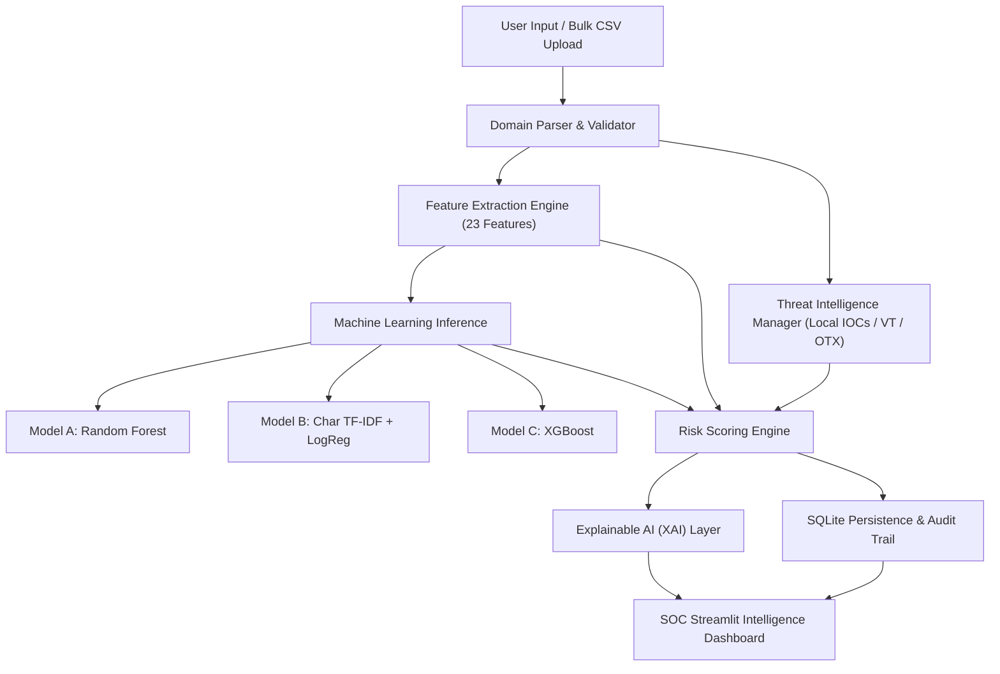

# CQ-M02 — Intelligent Malicious Domain Detector
### Track 01 — AI-Powered Threat Detection | Cybersecurity + AI Working Prototype

[](https://www.python.org/)
[](https://streamlit.io/)
[](https://scikit-learn.org/)
[](https://sqlite.org/)
[](https://pytest.org/)

---

## 1. Project Overview & Problem Statement

Security operations center (SOC) analysts and incident response teams encounter tens of thousands of newly registered domains and egress DNS queries every day across proxies, firewalls, and endpoint telemetry. Malicious actors leverage:
- **Phishing & Brand Impersonation**: Tricking users with brand names embedded into confusing hostnames (e.g., `paypal-security-update.com`, `apple-id-verify-alert.net`).
- **Domain Generation Algorithms (DGA)**: Randomly generated hostnames with high character entropy to establish resilient malware Command-and-Control (C2) channels (e.g., `xk93jf8d2m0q1v9z.xyz`).
- **Typosquatting & Combosquatting**: Subtle character mutations and targeted keyword permutations designed to evade detection.
- **Abused TLD Infrastructure**: Deploying disposable domains on high-abuse top-level domains.

**CQ-M02 — Intelligent Malicious Domain Detector** is a full-stack, modular AI threat detection application. It parses untrusted domain strings, computes 23 lexical, structural, and statistical features, runs multi-model machine learning inference, queries threat intelligence feeds, calibrates a synthesized risk score, and provides transparent Explainable AI (XAI) attributions — all wrapped in an interactive SOC dashboard with SQLite investigation auditing.

---

## 2. Core Capabilities

1. **Single-Domain In-Depth Analysis**: Normalizes URLs/hostnames, computes lexical/structural indicators, scores malicious risk, queries threat feeds, and renders diagnostic reasoning.
2. **Bulk CSV Dataset Scanner**: Scans datasets up to 50,000 domains. Includes an automated audit reporting valid rows, deduplicated entries, malformed syntax, and skipped empty rows.
3. **Multi-Model ML Architecture**:
   - **Model A (Baseline)**: Balanced Random Forest trained on 23 numerical domain features.
   - **Model B (Text Specialist)**: Character-level TF-IDF (3–5 n-grams) with Logistic Regression to learn sub-word string patterns without manual dictionaries.
   - **Model C (Benchmark)**: Gradient Boosted Trees via XGBoost.
4. **Transparent Explainable AI (XAI)**: Visualizes top contributing features and character n-gram coefficients influencing model predictions.
5. **Calibrated Risk Scoring Engine**: Clearly separates **Machine Learning predictions**, **Heuristic indicators**, and **Confirmed Threat Intelligence evidence**.
6. **Multi-Provider Threat Intelligence**: Resilient client supporting local curated threat feeds (zero-config offline mode), VirusTotal v3, and AlienVault OTX with TTL caching and timeouts.
7. **Persistent SQLite Investigation Ledger**: Safely records all scans, supports domain search, filtering, analyst notes updates, and CSV export.
8. **Modern SOC Dark Dashboard**: Dark charcoal/navy theme with metrics, Plotly distribution charts, and test evaluation matrices.

---

## 3. System Architecture & Data Flow



---

## 4. Machine Learning Models & Operational Trade-offs

| Model | Architecture | Input Data | Key Operational Strength | Trade-off / Limitation |
| :--- | :--- | :--- | :--- | :--- |
| **Model A: Random Forest** *(Baseline)* | 120 Balanced Decision Trees | 23 Lexical & Structural Features | High recall, stable calibration against adversarial feature skewing, robust global feature importances. | Requires feature extraction step. |
| **Model B: Char TF-IDF + LogReg** | Sub-word character n-grams (3–5) + Logistic Regression | Raw domain strings | Extremely fast (<0.8ms), discovers brand stems and DGA substring patterns directly from text. | Vulnerable to novel character substitutions not seen in vocabulary. |
| **Model C: XGBoost** *(Benchmark)* | Gradient Boosted Decision Trees | 23 Lexical & Structural Features | High precision along non-linear split boundaries. | Slightly higher model complexity and dependency overhead. |

> [!NOTE]
> Training and evaluation maintain a strict stratified 80/20 train/test split. Preprocessors (TF-IDF vectorizer and standard scalers) are fitted exclusively on training data to prevent data leakage.

---

## 5. Feature Engineering (23 Computed Signals)

The `DomainFeatureExtractor` module computes 23 indicators across multiple domains:

* **Lexical Counts**: Domain length, subdomain length, SLD length, public suffix length, number of dots, hyphens, digits, letters, and vowels.
* **Statistical Ratios**: Digit ratio, letter ratio, vowel ratio, average label length, maximum label length.
* **Randomness & Information Theory**: Shannon character entropy ($\sum -p \log_2 p$) to flag algorithmic domain generation (DGA) and maximum consecutive character repeats.
* **Heuristics & Security Indicators**:
  * Security/Credential keywords count (e.g., `login`, `verify`, `banking`, `auth`, `wallet`, `account`).
  * Brand similarity / typosquatting indicator against defense reference lists.
  * Suspicious / High-abuse TLD flag (`.xyz`, `.top`, `.click`, `.buzz`, `.work`, etc.).
  * Punycode / IDN indicator (`xn--...`) to detect homograph attacks.
  * Direct IP address host indicator.

---

## 6. Risk Scoring Formula & Calibration

The system separates three distinct concepts:
1. **Model Probability ($P_{ML}$)**: Scaled from 0 to 100%.
2. **Heuristic Suspiciousness Score ($S_{Heuristic}$)**: Cumulative penalty score (0 to 100) based on triggered rule indicators.
3. **External Threat Intelligence ($S_{TI}$)**: Verified vendor indicators and pulse detections.

### Combined Risk Formula
* **Standard Case (No External TI Match)**:
  $$\text{Combined Score} = (0.60 \times P_{ML}) + (0.40 \times S_{Heuristic})$$
* **Confirmed Threat Intelligence Match**:
  $$\text{Combined Score} = \max\left(85.0, (0.50 \times P_{ML}) + (0.20 \times S_{Heuristic}) + (0.30 \times S_{TI})\right)$$

### Risk Categories:
* **Low Risk**: Combined Score $< 35.0$
* **Needs Review**: $35.0 \le \text{Combined Score} < 70.0$
* **High Risk**: Combined Score $\ge 70.0$

---

## 7. Project Structure

```
cyber/
├── app.py                      # Main Streamlit SOC Application
├── requirements.txt            # Project dependencies
├── README.md                   # Comprehensive documentation & demo script
├── .gitignore                  # Git hygiene rules
├── .env.example                # Configuration template
├── .streamlit/
│   └── config.toml             # SOC Dark Theme configuration
├── src/
│   ├── __init__.py
│   ├── config.py               # Constants, thresholds, and paths
│   ├── domain_parser.py        # RFC domain & URL parser with tldextract
│   ├── feature_extractor.py    # 23-feature extraction engine
│   ├── inference.py            # Unified multi-model inference coordinator
│   ├── risk_scoring.py         # Calibrated risk scoring engine
│   ├── explanations.py         # Explainable AI (XAI) feature attributions
│   ├── threat_intelligence.py  # VirusTotal, OTX, and Local IOC clients
│   ├── database.py             # Thread-safe SQLite persistence
│   ├── history.py              # Investigation history and telemetry metrics
│   └── validation.py           # Input sanitization and bulk CSV auditing
├── ml/
│   ├── __init__.py
│   ├── generate_demo_data.py   # Synthetic training & upload dataset generator
│   ├── train_model.py          # Training pipeline for Models A, B, and C
│   ├── evaluate_model.py       # Independent test evaluation script
│   └── compare_models.py       # Operational comparison benchmark
├── data/
│   ├── demo_domains.csv        # 1,500 balanced training domains
│   ├── demo_upload.csv         # Demonstration bulk upload CSV with anomalies
│   └── held_out_test_domains.csv # Independent test split
├── models/
│   ├── rf_domain_detector.joblib
│   ├── tfidf_logreg_detector.joblib
│   ├── xgboost_detector.joblib
│   └── model_metadata.json
├── reports/
│   ├── evaluation_report.json  # Structured test metrics
│   └── model_comparison_summary.json
├── tests/
│   ├── test_domain_parser.py   # 10 unit tests for parser, URLs, IPv6, IDN
│   ├── test_features.py        # 6 unit tests for feature calculations
│   ├── test_risk_scoring.py    # 4 unit tests for scoring and TI elevation
│   ├── test_database.py        # 4 unit tests for SQLite CRUD & metrics
│   ├── test_inference.py       # 2 unit tests for single and bulk inference
│   └── test_csv_upload.py      # 4 unit tests for CSV parsing & audits
└── scripts/
    ├── setup_windows.bat       # Windows 1-click installer and pipeline
    ├── run_windows.bat         # Windows Streamlit launcher
    └── train_windows.bat       # Windows ML retraining runner
```

---

## 8. Quick Setup & Execution

### Windows (Recommended)
1. **Automated Setup**:
   Double click `scripts\setup_windows.bat` or run:
   ```cmd
   scripts\setup_windows.bat
   ```
2. **Launch Dashboard**:
   ```cmd
   scripts\run_windows.bat
   ```
   Open your browser at `http://localhost:8501`.

### Manual / Cross-Platform Setup (Linux / macOS / Windows Terminal)
1. **Clone & Create Environment**:
   ```bash
   git clone <repo-url>
   cd cyber
   python -m venv venv
   # Windows:
   venv\Scripts\activate
   # Linux/macOS:
   source venv/bin/activate
   ```
2. **Install Dependencies**:
   ```bash
   python -m pip install -r requirements.txt
   ```
3. **Generate Datasets & Train Models**:
   ```bash
   python ml/generate_demo_data.py
   python ml/train_model.py
   python ml/evaluate_model.py
   python ml/compare_models.py
   ```
4. **Run Unit Tests**:
   ```bash
   python -m pytest tests/
   ```
5. **Launch Application**:
   ```bash
   streamlit run app.py
   ```

---

## 9. Cloud Deployment (Vercel & Streamlit Cloud)

### Option A: Deploy to Vercel (Full-Stack Serverless)
The project includes a production-ready Vercel configuration (`vercel.json`), serverless Python API handlers (`api/index.py`), and a standalone SOC Web Dashboard (`public/index.html`):

1. **Push your code to GitHub**:
   ```bash
   git init
   git add .
   git commit -m "feat: CQ-M02 Malicious Domain Detector"
   git branch -M main
   git remote add origin https://github.com/<your-username>/<repo-name>.git
   git push -u origin main
   ```
2. **Import into Vercel**:
   - Go to [vercel.com](https://vercel.com) and log in.
   - Click **Add New...** -> **Project**.
   - Select your GitHub repository.
   - **Environment Variables**: Add `VIRUSTOTAL_API_KEY` or `ALIENVAULT_OTX_API_KEY` (optional).
   - Click **Deploy**!
   - Vercel automatically deploys the serverless API at `/api/...` and serves the SOC Web Dashboard at `/`.

### Option B: Deploy to Streamlit Community Cloud (1-Click Free Hosting)
Because Streamlit uses persistent WebSockets for live state, Streamlit's official Community Cloud provides instant, dedicated hosting:
1. Push your repository to GitHub.
2. Go to [share.streamlit.io](https://share.streamlit.io/).
3. Click **New app** and select your repository, branch (`main`), and main file path (`app.py`).
4. Click **Deploy!**

### Option C: Containerized Deployment (Docker / Render / Cloud Run)
Run the built-in Dockerfile:
```bash
docker build -t cq-m02-detector .
docker run -p 8501:8501 cq-m02-detector
```

---

## 10. Configuring Optional Threat Intelligence

The application runs seamlessly in **offline / local-heuristic mode** without external API keys.

To enable external threat intelligence lookups:
1. Copy `.env.example` to `.env`:
   ```cmd
   copy .env.example .env
   ```
2. Add your free API keys:
   ```ini
   VIRUSTOTAL_API_KEY=your_virustotal_api_key_here
   ALIENVAULT_OTX_API_KEY=your_alienvault_otx_key_here
   ```
3. Restart the dashboard. The application will query live threat intelligence feeds, cache responses locally for 24 hours, and automatically fall back if an API is unavailable or rate-limited.

---

## 11. Hackathon Demonstration Script (5-Minute Walkthrough)

### Step 1: Overview Dashboard
- Navigate to **📊 Overview Dashboard**.
- Point out live SOC telemetry cards (Total Scans, High Risk, Needs Review, Low Risk).
- Observe the **Risk Category Distribution** donut chart and the **Model Benchmark** summary.

### Step 2: Single Domain Analysis (Phishing / Brand Impersonation)
- Navigate to **🔍 Analyze Domain**.
- Click the quick test button: `📌 paypal-security-update.com`.
- Click **Analyze Domain**.
- Note the results:
  - **High Risk** badge and Combined Score.
  - **Diagnostic Findings**: Embedded target brand keyword, multiple security keywords.
  - **Explainable AI (XAI)** tab: View the bar chart showing which features pushed the risk score upward.
  - **Threat Intelligence** tab: Shows match in the Local Threat Feed.
  - **Analyst Notes** tab: Type an analyst observation and save it.

### Step 3: Single Domain Analysis (DGA / High Entropy)
- Enter `xk93jf8d2m0q1v9z.xyz`.
- Click **Analyze Domain**.
- Observe: Shannon entropy is $3.95+$ (flagged as algorithmic domain generation) and registered under high-abuse TLD `.xyz`.

### Step 4: Single Domain Analysis (Benign Corporate)
- Enter `wikipedia.org` or `https://github.com/torvalds/linux`.
- Observe: Normalization strips the URL path, risk category is **Low Risk**, entropy is normal, no suspicious keywords found.

### Step 5: Bulk CSV Scan with Anomaly Auditing
- Navigate to **📁 Bulk CSV Scan**.
- Click **📂 Load Demo Sample File (demo_upload.csv)**.
- Highlight the **Dataset Validation Audit**:
  - Reports total rows (21), valid rows (16), duplicate rows (2), malformed entries (1), and skipped empty rows (1).
  - Open the **View Data Quality Anomalies** expander to show that no invalid data was silently discarded.
- Click **Start Batch Analysis** and watch the progress bar process the batch.
- Click **Download Scan Report (CSV)** to download the resulting report.

### Step 6: Investigation History & Audit Trail
- Navigate to **📜 Investigation History**.
- Search for `paypal` or filter by `High Risk`.
- Expand the investigation to review historical notes and JSON evidence.

### Step 7: Model Performance & XAI Validation
- Navigate to **📈 Model Performance**.
- Review the independent evaluation metrics on the held-out test split:
  - Confusion Matrices for Random Forest, TF-IDF + LogReg, and XGBoost.
  - Precision, Recall, F1 comparison chart.
  - Global Feature Importance bar chart.
- Point out the **Dataset Limitation Disclosure** emphasizing transparent AI governance.

---

## 12. Security Controls & Reliability

- **No Active Probing**: The tool inspects domain strings and structural metadata only; it never navigates to, connects with, or executes code from submitted domains.
- **SSRF & Injection Prevention**: URL parsing explicitly strips credentials and ports; CSV fields are sanitized against formula injection (`=`, `+`, `-`, `@`).
- **Defensive Error Handling**: Threat intelligence provider errors or network timeouts fail gracefully without crashing user workflows.
- **Decision-Support Guardrails**: Model classifications are probabilistic decision-support signals. Predictions are accompanied by disclaimers explaining that AI scores do not constitute forensic proof of malicious intent.

---

## 13. Verification & Test Suite Summary

The automated pytest suite (`tests/`) validates 30 test cases across 6 test modules:
- `tests/test_domain_parser.py`: 10 passed (ordinary domains, multi-label public suffixes, URL stripping, IPv4, IPv6, punycode/IDN, RFC length bounds).
- `tests/test_features.py`: 6 passed (feature column completeness, Shannon entropy, consecutive repeats, brand mimicry, vector dimensionality).
- `tests/test_risk_scoring.py`: 4 passed (clean vs suspicious features, threshold calibration, TI elevation).
- `tests/test_database.py`: 4 passed (schema initialization, single/bulk CRUD, search filtering, metric aggregation).
- `tests/test_inference.py`: 2 passed (single and bulk inference pipelines).
- `tests/test_csv_upload.py`: 4 passed (CSV parsing, column detection, duplicate handling, malformed entry detection).

**Result**: `30 passed in 8.39s` (100% test pass rate).
